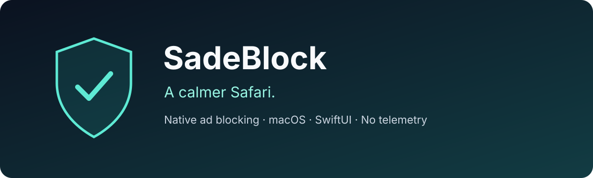

<p align="center">
  
</p>

# SadeBlock — Safari Ad Blocker for macOS

[](https://github.com/halilozel1903/SadeBlock/actions/workflows/ci.yml)
[](#requirements)
[](#how-it-works)
[](LICENSE)

**A native, open-source Safari content blocker that blocks requests to known advertising and tracking services without reading your browsing history.**

SadeBlock combines a small, inspectable ruleset with a SwiftUI companion app. Safari applies the blocking rules; the app helps you check extension status and reload the bundled filters. There are no accounts, analytics SDKs, external package dependencies, or subscription services.

> **Early-stage project:** SadeBlock currently ships 126 manually maintained rules. It is a starting point for native Safari ad blocking, not a comprehensive or automatically updated filter subscription. YouTube and other in-video ads are not guaranteed to be blocked.

[Get started](#getting-started) · [How it works](#how-it-works) · [Limitations](#limitations) · [Contribute](CONTRIBUTING.md)

## Features

- **Native Safari content blocking:** declarative rules handled by Safari, with no injected JavaScript from the extension.
- **Ad and tracker filtering:** 124 domain rules target third-party requests to advertising, header-bidding (Prebid) and tracking services, including Google Ad Manager, Yandex and Turkish ad networks such as Mediazone and Admatic.
- **Cosmetic filtering:** a generic rule hides Google Ad Manager/AdSense slots (including sticky anchor ads), Yandex, Taboola and Outbrain widgets; a site-specific rule cleans up webtekno.com ad columns and sponsored links.
- **Private by design:** no browsing-history access, request logging, telemetry, or collection endpoints.
- **Native macOS interface:** an English SwiftUI dashboard shows Safari’s reported activation state and provides rule reloading.
- **Readable source:** the complete filter list is a version-controlled JSON file you can inspect and edit.

## Requirements

| Component | Requirement |
| --- | --- |
| Operating system | macOS 13 Ventura or later |
| Browser | Safari on macOS |
| Development | Xcode 15 or later with the macOS SDK |
| Local testing | Ad-hoc signing and Safari’s unsigned-extension development setting may be required |
| Distribution | Appropriate Apple signing and distribution setup; this repository is not an App Store release |

The minimum Xcode version follows the APIs and project format used here; the initial local build was verified with the installed Swift 6.4 toolchain. The workflow above reports compatibility with the hosted macOS runner.

## Getting started

### 1. Build the app

Clone the repository and open the Xcode project:

```sh
git clone https://github.com/halilozel1903/SadeBlock.git
cd SadeBlock
open SadeBlock.xcodeproj
```

Select the **SadeBlock** scheme and **My Mac**, then choose **Product → Run**.

Alternatively, build from the command line:

```sh
xcodebuild \
  -project SadeBlock.xcodeproj \
  -scheme SadeBlock \
  -configuration Release \
  -derivedDataPath build \
  build

open build/Build/Products/Release/SadeBlock.app
```

### 2. Enable the extension

1. Open **Safari → Settings → Extensions**.
2. Enable **SadeBlock**.
3. Return to the app and refresh its status.
4. Reload open webpages so Safari can apply the rules.

**Signing:** both targets use automatic signing. Before the first run, open each target (**SadeBlock** and **SadeBlockBlocker**) → **Signing & Capabilities** and select the same **Team** (a free Personal Team works). Safari does not list extensions without a team signature.

**If SadeBlock still does not appear:** run the app once, then check `pluginkit -mAvvv -p com.apple.Safari.content-blocker`. For unsigned local builds, enable **Allow unsigned extensions** in Safari's developer settings (it resets when Safari restarts). See [Apple’s extension development instructions](https://developer.apple.com/documentation/safariservices/building-a-safari-app-extension).

### 3. Check a website

Compare a page with content blockers enabled and disabled using Safari’s settings for that website, reloading between checks. Coverage depends on the domains and ad placements in the bundled ruleset. SadeBlock does not display blocked-request counts because it does not observe your browsing traffic.

## How it works

```text
Bundled blockerList.json
          │
          ▼
Safari Content Blocker extension
          │ supplies declarative rules
          ▼
Safari / WebKit
          ├── blocks matching third-party requests
          └── hides matching ad elements

SwiftUI companion app → checks activation / requests rule reloads
```

The extension returns the bundled JSON through `NSExtensionRequestHandling`. Safari compiles and applies those rules. The companion app uses `SFContentBlockerManager` to query activation and request reloads.

Domain patterns are anchored to the URL’s hostname. This helps avoid treating a normal page as an ad request merely because its path or query contains an advertising domain. Network rules are restricted to third-party loads; cosmetic rules apply to matching page elements.

Read more about [Apple’s Content Blocker architecture](https://developer.apple.com/library/archive/documentation/General/Conceptual/ExtensibilityPG/ContentBlocker.html).

## Customize the filters

Edit [`Blocker/blockerList.json`](Blocker/blockerList.json), rebuild and run the app, then select **Reload Rules**. Reload affected Safari tabs afterward.

A domain-blocking rule follows this structure:

```json
{
  "trigger": {
    "url-filter": "^https?://([^/]+\\.)?ads-example\\.com(:[0-9]+)?/",
    "load-type": ["third-party"]
  },
  "action": { "type": "block" }
}
```

The example domain is illustrative and is not included in the shipped rules. Keep patterns narrow and test both intended matches and ordinary URLs. **Reload Rules** reloads the JSON already bundled in the app; it does not download a new filter list.

## Validation

Run the rule checks from the repository root:

```sh
swift Tests/ValidateRules.swift Blocker/blockerList.json
```

The validation script:

- Compiles the entire ruleset with the real WebKit content-rule compiler.
- Checks four representative ad/tracker URLs and five URLs that must not match.
- Verifies that domain-blocking rules remain restricted to third-party requests.
- Removes its temporary compiled rules after validation.

The initial local Release build and all URL cases passed. These checks verify rule syntax and selected URL boundaries; they do **not** establish blocking effectiveness across live websites. Safari activation, visual filtering, and real-world site compatibility still require manual testing. GitHub Actions also builds the app and runs the rule validator on macOS.

## Limitations

- The bundled rules are manually selected and are not EasyList, EasyPrivacy, or a full replacement for a mature filter subscription.
- First-party advertising, sponsored posts, and some video ads may remain visible.
- There is no automatic filter update service, custom-rule editor, or in-app site allowlist.
- Cosmetic selectors can occasionally hide legitimate elements. Disable content blockers for an affected site using Safari’s website settings.
- The app is not notarized or published on the Mac App Store. Local builds require the development setup described above.
- This project targets **macOS Safari**; an iPhone or iPad app is not included.

## Project structure

```text
App/                    SwiftUI companion app and app configuration
Blocker/                Safari extension, bundled rules, and extension configuration
Tests/                  WebKit compilation and URL-boundary checks
SadeBlock.xcodeproj/     Xcode project and shared scheme
.github/workflows/      macOS build and validation workflow
docs/                   Repository artwork
```

## Signing and distribution

For your own signed build, configure both targets under **Signing & Capabilities** with your Apple development team and unique bundle identifiers. Update the extension identifier in `App/SadeBlockApp.swift` to match the blocker target. Enable the appropriate signing configuration for both targets and complete Apple’s distribution requirements before sharing a production binary.

No signing credentials or provisioning profiles are included in this repository.

## Contributing

Reproducible site-breakage reports, focused filter improvements, and macOS accessibility fixes are welcome. See [CONTRIBUTING.md](CONTRIBUTING.md) for the workflow and information to include in a report.

If SadeBlock is useful to you, consider starring the repository or sharing it with someone building native Safari extensions.

## License

[MIT](LICENSE) © 2026 [halilozel1903](https://github.com/halilozel1903).
